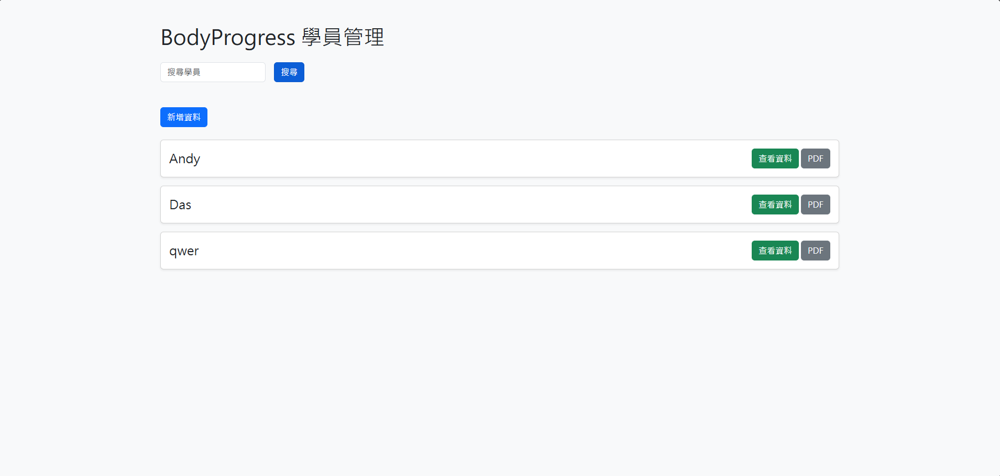
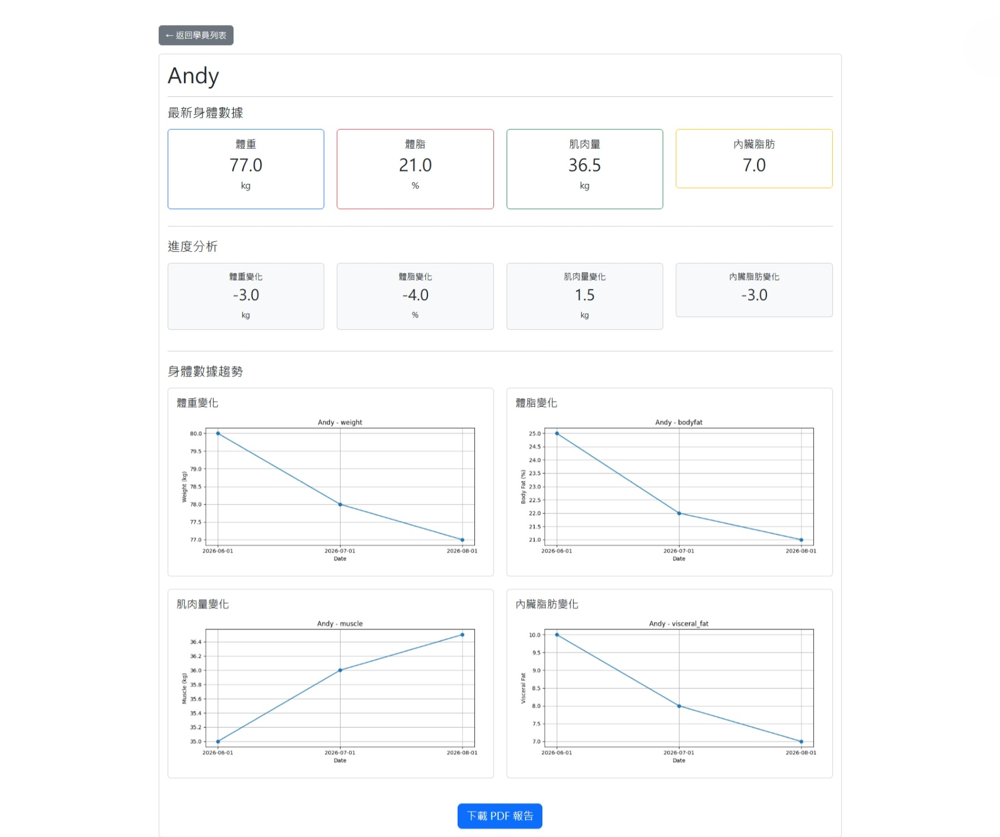

# BodyProgress

BodyProgress is a fitness progress tracking system built with FastAPI.

Users can record body measurements, track progress through charts, and generate PDF reports for students.

---

## Features

### Dashboard

* Student count
* Measurement count
* Bootstrap UI

### Student Management

* Add measurements
* Search students
* View student details

### Progress Charts

* Weight trend
* Body fat trend
* Muscle trend
* Visceral fat trend

### PDF Reports

* Generate PDF reports automatically
* Download reports from the web interface

---

## Screenshots

### Dashboard


### Student List



### Student Detail



---

## Tech Stack

* Python
* FastAPI
* Pandas
* Matplotlib
* ReportLab
* Jinja2
* Bootstrap 5

---

## Project Structure

```text
BodyProgress
│
├── webapp/
├── templates/
├── pdf_reports/
├── charts/
├── screenshots/
├── students.csv
├── chart.py
├── pdf_report.py
└── README.md
```

---

## Installation

```bash
pip install -r requirements.txt
```

Run:

```bash
uvicorn webapp.app:app --reload
```

Open:

```text
http://127.0.0.1:8000
```

---

## Future Improvements

* SQLite database
* User authentication
* Cloud deployment
* Docker support
* Export Excel reports
